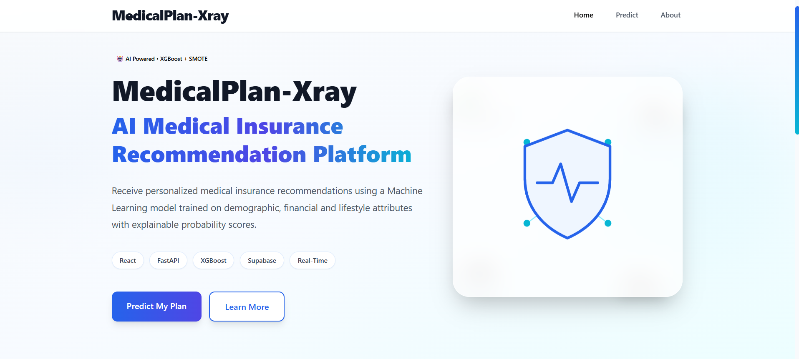
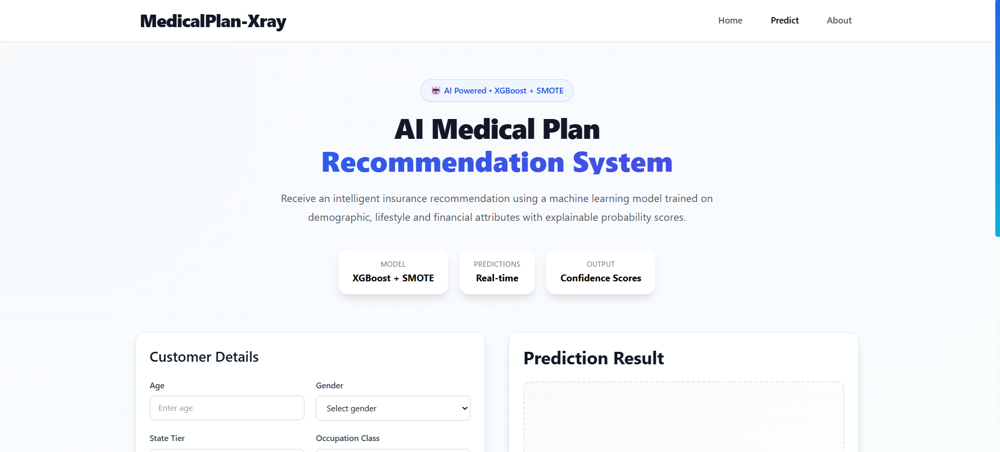
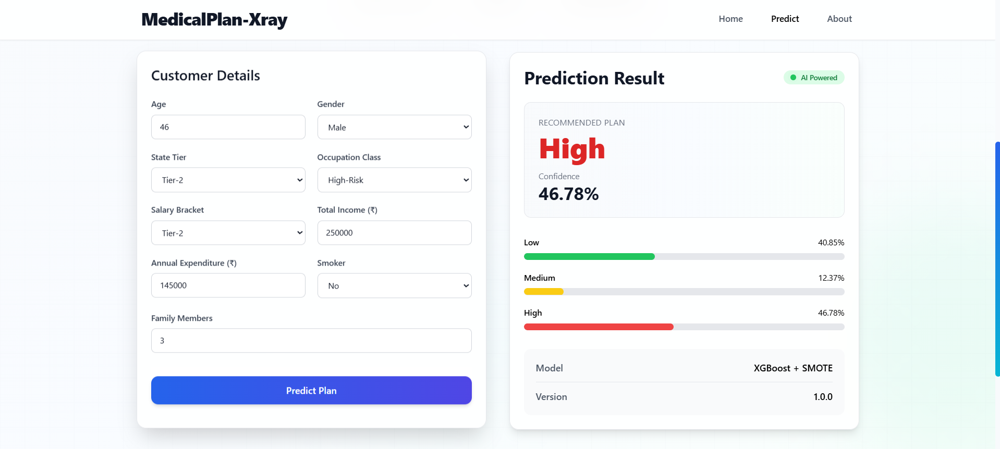
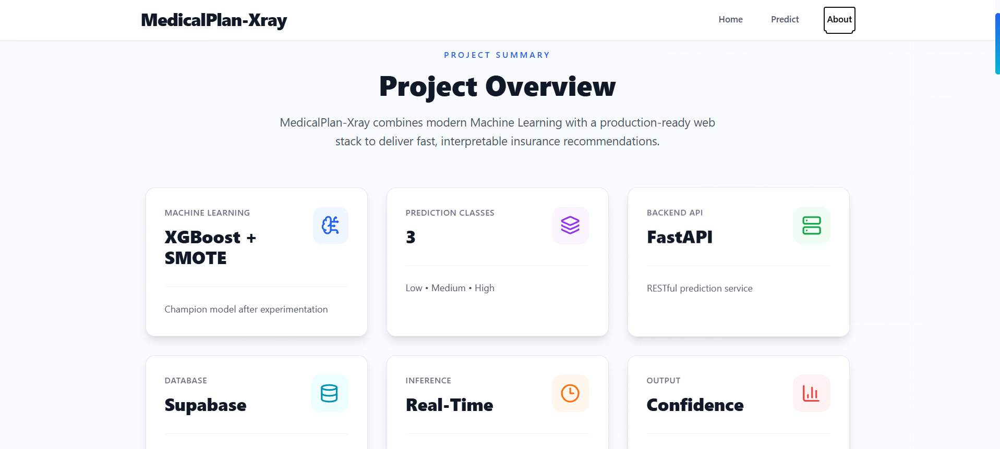
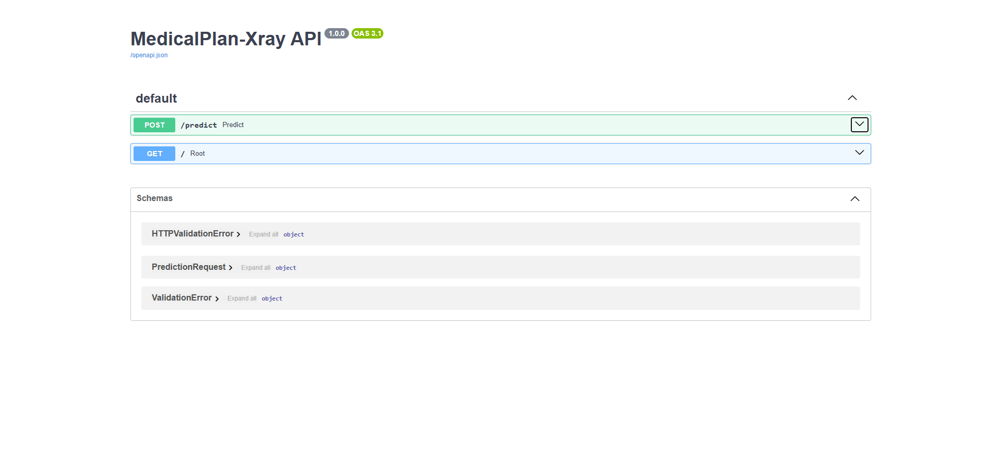
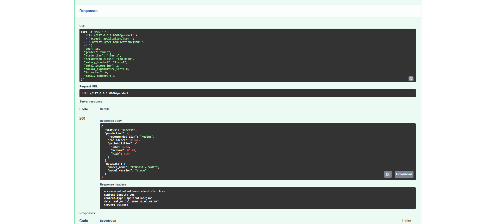

# MedicalPlan-Xray

### End-to-End Machine Learning System for Medical Insurance Plan Recommendation


------------------------------------------------------------------------

## Overview

MedicalPlan-Xray is an end-to-end machine learning project that
recommends an appropriate medical insurance plan (Low, Medium or High)
using demographic, financial and lifestyle information.

The project demonstrates a complete ML lifecycle, from data preparation
and feature engineering to model training, a production-style FastAPI
backend, prediction logging with Supabase, automated validation and
reproducible deployment.

------------------------------------------------------------------------

## 🚀 Production Highlights

- End-to-end Machine Learning application for medical insurance recommendation
- Production-ready FastAPI backend deployed on Northflank
- Responsive React frontend deployed on Vercel
- Dockerized full-stack deployment using Docker Compose
- Serialized preprocessing and XGBoost pipeline for consistent inference
- Real-time prediction API with confidence scores
- Supabase integration for prediction logging
- Feature-engineered inference pipeline with input validation

------------------------------------------------------------------------

## 🌐 Live Demo

### Frontend

https://medical-plan-xray.vercel.app

### Backend API

https://site--medicalplan-xray--z9wsmn2822p9.code.run

### Interactive Swagger Documentation

https://site--medicalplan-xray--z9wsmn2822p9.code.run/docs

------------------------------------------------------------------------

## Features

- End-to-end XGBoost + SMOTE classification pipeline
- Serialized preprocessing and trained model in a single artifact
- Automated feature engineering during inference
- Production-ready FastAPI REST API
- Responsive React frontend with real-time predictions
- Confidence scores and class probability visualization
- Supabase prediction logging
- Pydantic request validation
- Out-of-distribution input warnings
- Dockerized full-stack deployment
- Cloud deployment using Vercel and Northflank
- Reproducible environment with pinned dependencies
- Unit testing with Pytest

------------------------------------------------------------------------

## Business Problem

Insurance providers often need to recommend plans consistently and
quickly. This project automates that decision using historical customer
information while exposing predictions through an API suitable for
integration into other applications.

------------------------------------------------------------------------

## Dataset

| Property | Value |
|----------------------|----------------------------|
| Records | 980 |
| Target Classes | 3 |
| Original Features | 11 |
| Engineered Features | 4 |
| Problem Type | Multi-class Classification |

Target classes:

- Low
- Medium
- High

------------------------------------------------------------------------

## Repository Structure

```text
MedicalPlan-Xray/
├── backend/
│   ├── app/
│   ├── models/
│   ├── requirements.txt
│   └── Dockerfile
├── frontend/
│   ├── src/
│   ├── nginx.conf
│   ├── Dockerfile
│   └── package.json
├── data/
├── notebooks/
├── tests/
├── visuals/
├── .env.example
├── docker-compose.yml
├── README.md
└── LICENSE
```

------------------------------------------------------------------------

## Machine Learning Workflow

1. Data Cleaning
2. Exploratory Data Analysis
3. Feature Engineering
4. Data Preprocessing
5. Model Training
6. Hyperparameter Tuning
7. Model Selection
8. FastAPI Integration
9. Frontend Integration
10. Cloud Deployment
11. Prediction Logging

------------------------------------------------------------------------

## Feature Engineering

Engineered features include:

- Expense Ratio
- Savings
- Income per Family Member
- Expenditure per Family Member

------------------------------------------------------------------------

## Model

The deployed model is an **XGBoost classifier** trained inside an
**imbalanced-learn Pipeline** containing:

- ColumnTransformer
- StandardScaler
- OneHotEncoder
- SMOTE
- XGBoost Classifier

This ensures training and inference use identical preprocessing.

------------------------------------------------------------------------

## Model Performance

The final production model uses an XGBoost classifier trained within an imbalanced-learn pipeline incorporating SMOTE for handling class imbalance.

Key characteristics:

- Multi-class classification
- Engineered financial features
- Serialized preprocessing pipeline
- Consistent training and inference workflow
- Probability-based recommendations

------------------------------------------------------------------------

## Backend Architecture

```text
React Frontend (Vercel)
          │
          ▼
     Nginx Reverse Proxy
          │
          ▼
 FastAPI Backend (Northflank)
          │
          ▼
 Feature Engineering
          │
          ▼
 Serialized ML Pipeline
          │
          ▼
 Prediction Engine
          │
          ▼
 Supabase Logging
```

------------------------------------------------------------------------

## Deployment

| Component         | Technology              |
| ----------------- | ----------------------- |
| Frontend          | React + Vercel          |
| Backend           | FastAPI + Northflank    |
| Containerization  | Docker + Docker Compose |
| Reverse Proxy     | Nginx                   |
| Database          | Supabase                |
| Model             | XGBoost + SMOTE         |
| API Documentation | Swagger UI              |

------------------------------------------------------------------------

## API

### POST /predict

Returns:

- Recommended plan
- Confidence
- Class probabilities
- Model metadata

Example response:

```json
{
  "status": "success",
  "prediction": {
    "recommended_plan": "Medium",
    "confidence": 89.62
  }
}
```

------------------------------------------------------------------------

## Installation

Clone the repository:

```bash
git clone https://github.com/Adityam-21/MedicalPlan-Xray.git
cd MedicalPlan-Xray
```

### Option 1 — Docker (Recommended)

1. Copy the example environment file:

```bash
cp .env.example .env
```

2. Add your Supabase credentials to `.env`:

```text
SUPABASE_URL=your_supabase_url
SUPABASE_KEY=your_supabase_key
```

3. Build and start the application:

```bash
docker compose up --build
```

The application will be available at:

| Service | URL |
|---------|-----|
| Frontend | http://localhost:3000 |
| Backend API | http://localhost:8000 |
| Swagger Documentation | http://localhost:8000/docs |

---

### Option 2 — Manual Setup

Create and activate a virtual environment:

```bash
python -m venv venv

# Windows
venv\Scripts\activate
```

Install the required dependencies:

```bash
pip install -r requirements.txt
```

Copy the example environment file:

```bash
cp .env.example .env
```

Add your Supabase credentials to `.env`:

```text
SUPABASE_URL=your_supabase_url
SUPABASE_KEY=your_supabase_key
```

Run the FastAPI application:

```bash
python -m uvicorn backend.app.main:app --reload
```

The application will be available at:

| Service | URL |
|---------|-----|
| Backend API | http://127.0.0.1:8000 |
| Swagger Documentation | http://127.0.0.1:8000/docs |

------------------------------------------------------------------------

## Running Tests

Run the test suite:

```bash
python -m pytest
```

Current Status

```text
2 tests passed
```

------------------------------------------------------------------------

## Technology Stack

### Machine Learning

- XGBoost
- Scikit-learn
- Imbalanced-Learn
- Pandas
- NumPy

### Backend

- FastAPI
- Pydantic
- SQLAlchemy

### Frontend

- React
- Tailwind CSS
- Axios

### Database

- Supabase

### DevOps

- Docker
- Docker Compose
- Nginx
- Northflank
- Vercel

### Testing

- Pytest

------------------------------------------------------------------------

# 📸 Application Preview

Explore the production-ready interface of **MedicalPlan-Xray**, including the user workflow from customer input to AI-powered insurance plan recommendations.

---

## 🖥️ Web Application

| 🏠 Home | 📝 Prediction |
|:--------:|:-------------:|
|  |  |

| 🤖 AI Recommendation | ℹ️ About |
|:-------------------:|:--------:|
|  |  |

---

## ⚡ API Documentation (Swagger UI)

The FastAPI backend automatically generates interactive API documentation for testing and exploring endpoints without additional tools.

| 📋 API Overview | 🚀 Prediction Endpoint |
|:--------------:|:----------------------:|
|  |  |

---

## 📱 Key Capabilities Demonstrated

- Responsive React frontend
- Real-time insurance plan prediction
- Confidence score visualization
- Multi-class probability distribution
- Interactive Swagger API documentation
- Production-ready FastAPI backend

------------------------------------------------------------------------

## Current Limitations

While the application is fully functional and deployed in production, the current version has a few engineering limitations that would typically be addressed in a larger scale production environment.

- Authentication and role-based access control are not implemented.
- CI/CD pipelines for automated testing and deployment are not yet configured.
- Model performance and prediction monitoring are not available.
- Automated model retraining and data drift detection are not implemented.
- The system currently supports single record inference only (no batch prediction endpoint).
- Prediction history analytics and operational dashboards are not included.

------------------------------------------------------------------------

## Future Roadmap

- GitHub Actions CI/CD
- Model monitoring and observability
- Data drift detection
- Automated retraining pipeline
- Authentication & authorization
- Dashboard analytics
- SHAP-based explainability dashboard
- Batch prediction endpoint

------------------------------------------------------------------------

## Author

**Kumar Adityam**

Machine Learning Engineer • Backend Developer

GitHub:
https://github.com/Adityam-21

LinkedIn:
https://linkedin.com/in/kumar-adityam-4b2b7b1b4

------------------------------------------------------------------------

## License

This project is released under the MIT License.